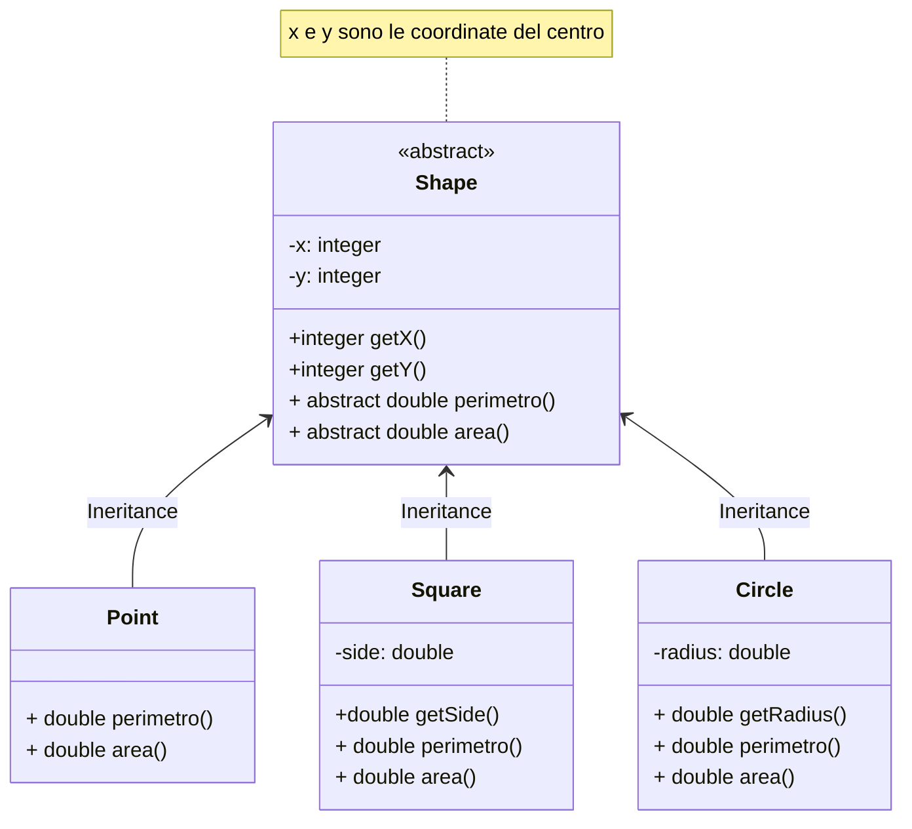

# Try Class Subclass

```mermaid

classDiagram
note for Shape "x e y sono le coordinate del centro"
class Shape {
    -x: integer
    -y: integer
} 
<<abstract>> Shape

Shape: +integer getX()
Shape: +integer getY()
Shape: + abstract double perimetro()
Shape: + abstract double area()

Shape<-- Point : Ineritance

Shape<-- Square : Ineritance

Shape<-- Circle: Ineritance

Point: + double perimetro()
Point: + double area()

class Square {
    -side: double
}

Square: +double getSide()
Square: + double perimetro()
Square: + double area()

class Circle {
    -radius: double
}

Circle: + double getRadius()
Circle: + double perimetro()
Circle: + double area()

```

## Esempio con Interface

Vedi: https://iisponti.gitbook.io/tecnologie_quinta_2023_24/esempio-classi-sottoclassi